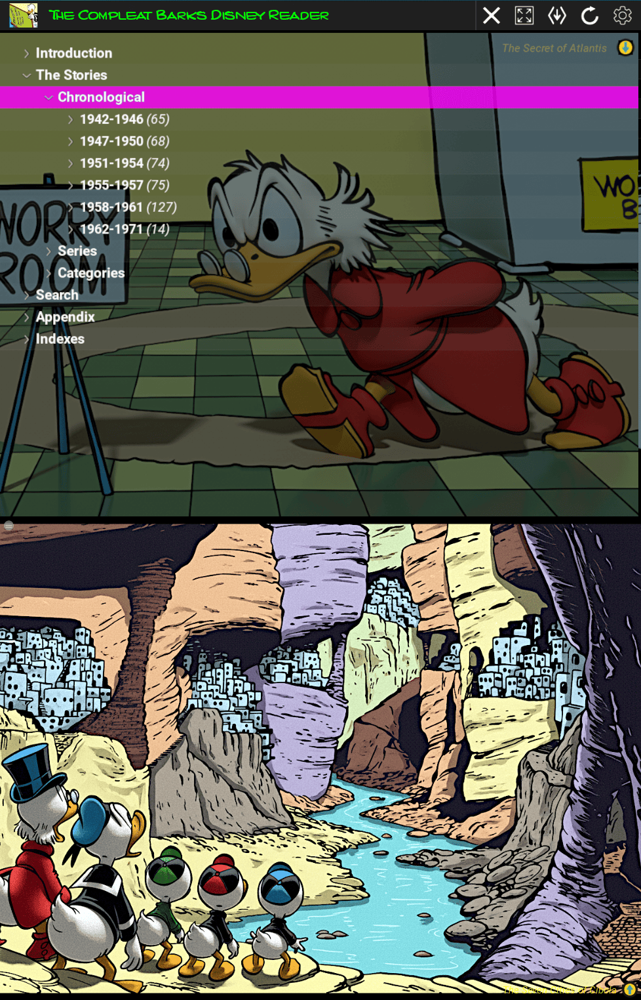
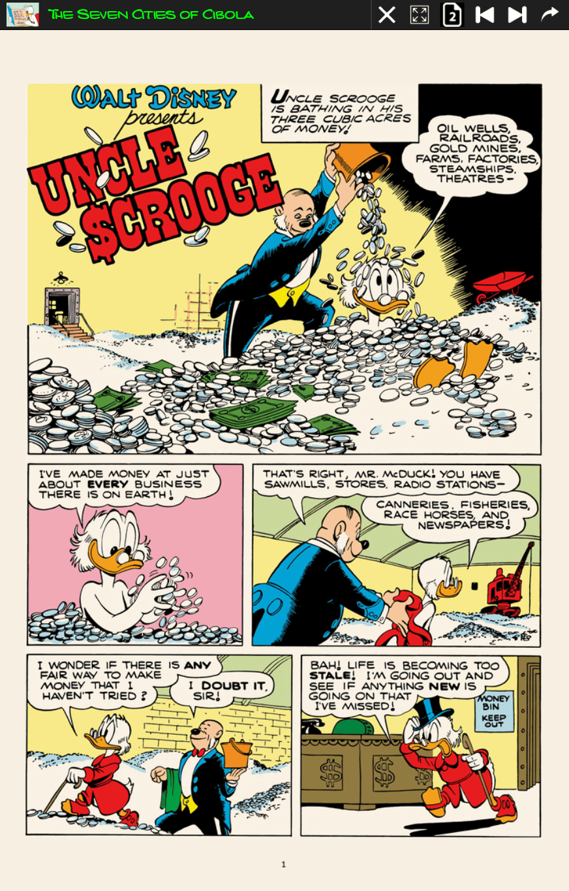
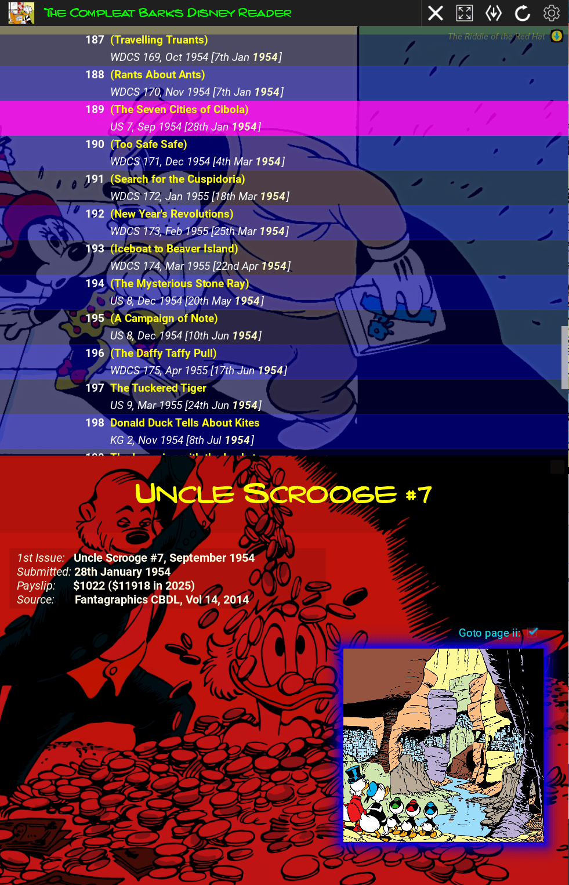
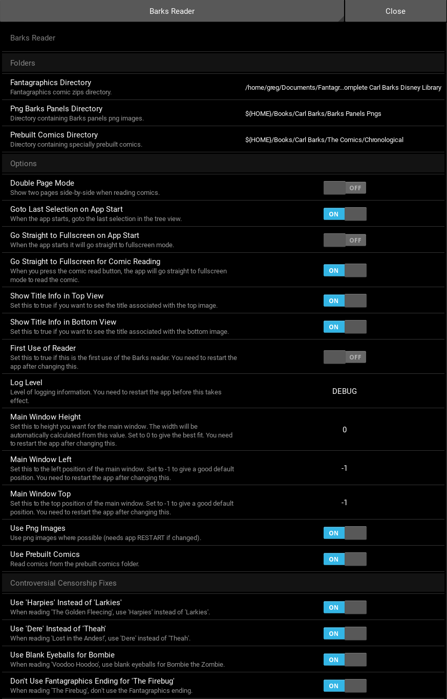

# The Compleat Barks Disney Reader

The Compleat Barks Disney Reader is a desktop application designed for browsing, searching, and reading the complete
collection of Carl Barks' Disney comics, specifically tailored for the Fantagraphics book series.

Built with the Kivy framework in Python, it provides a rich, cross-platform user experience with a focus on intuitive
navigation and a visually engaging interface.

> **Just want the app?** Download the standalone executable for Windows, macOS, or Linux from
> [the project website](https://glk1001.github.io/barks-compleat-reader/website/app.html) — no
> Python setup needed. The rest of this README is for running or building from source.

## Features

- **Comprehensive Browsing**: Navigate the entire collection in multiple ways:
    - **Chronological**: View stories in order based on their original submission date.
    - **Series**: Browse by comic book series (e.g., *Walt Disney's Comics and Stories*, *Donald Duck*, *Uncle Scrooge*).
    - **Categories**: Explore stories grouped by tags, such as characters, themes, or story types.
- **Search**: Quickly find titles by name or stories by specific tags using the integrated search boxes.
- **Rich User Interface**: A dynamic 'TreeView' provides easy navigation, while the main view displays context-aware
  background art and information related to the selected comic or category.
- **Full Keyboard & Remote Navigation**: Browse, open, and read comics using just the arrow keys, Enter, and Escape —
  designed to work from the couch with a TV remote as well as with a mouse or touchscreen.
- **Integrated Comic Reader**: A fullscreen, touch/click-friendly reader with intuitive page navigation (click
  left/right side of the screen) and a "go to page" dropdown for jumping directly to a specific page.
- **No Censorship**: Every attempt has been made to remove Disney and Fantagraphics censorship. This has been done
  using an override mechanism where censored pages in the original are overridden by fixed pages in the reader.
- **Smart Loading**: Asynchronously loads comic images in the background for a smooth, non-blocking user experience.
- **Customizable Viewing**: Supports optional override images for controversially restored or fixed pages, which can
  be toggled via a checkbox for specific titles.
- **Persistent State**: Remembers the last-read page for each comic and the last selected node on startup, allowing you
  to pick up right where you left off.

## Screenshots

|                        Main Window                        |                          Reading a Story                          |
|:---------------------------------------------------------:|:------------------------------------------------------------------:|
|         |           |
|                    **Selecting a Title**                   |                             **Settings**                            |
|  |                     |

More screenshots (including the full index and speech bubble index) are on
[the project website](https://glk1001.github.io/barks-compleat-reader/website/app.html).

---

## Requirements

- **Python**: 3.13 or newer.
- **Fantagraphics Comic Archives**: You must have access to the digital versions of the Fantagraphics Carl Barks
  Library, typically as `.zip` or `.cbz` files.
- **Python Dependencies**: The required Python packages can be installed via `uv.`

## Installation and Setup

Follow these steps to get the application running on your local machine.

**1. Clone the required repository**

```bash
git clone https://github.com/glk1001/barks-compleat-reader.git
cd barks-compleat-reader
```

**2. Install Dependencies**

You need to use *uv* for package management and a Python virtual environment.

```uv
# Install uv
curl -LsSf https://astral.sh/uv/install.sh | sh

# Install the required packages
uv sync
```

And install *just* to conveniently run commands.

```just
curl --proto '=https' --tlsv1.2 -sSf https://just.systems/install.sh | bash -s -- --to ~/.local/bin
```

**3. Initial Run and Configuration**

The first time you run the application, it will create a configuration file. You will then need to configure the path to
your comic archives.

```
just reader
```
1. When the application opens, click the **Settings** icon in the action bar.
1. In the settings panel, locate the setting for the **"Fantagraphics Volumes Directory"**.
1. Set this to the absolute path of the folder containing your Fantagraphics comic book archive files (the `.zip` or
   `.cbz` files).
1. Close the settings panel and **restart the application**.

The application will now load the titles from your specified directory.

## Usage

- **Run the application**:
```
just reader
```
- **Navigation**: Use the `TreeView` on the left to browse the collection.
- **View Info**: Click on a title in the tree to see its related comic art, publication details, and other information
  in the main panel at the bottom.
- **Read a Comic**: In the bottom right corner of the main panel, click the highlighted comic inset image to open
  the comic book reader.

---

## Testing

- **Unit tests** (about 3,700, mocked Kivy, run in CI on Linux, macOS and Windows):
    ```
    uv run pytest
    ```
- **GUI path tests** (73, Linux only): boot the real app from a scratch profile on a nested
  X display and drive it with the keyboard or by tapping, waiting only on lines the app logs. They need the
  reader's data directories and a few X tools; `bash scripts/gui-probe.sh doctor` says what
  is missing. Each passing test is also held to a set of teardown checks: the window is the
  size it booted at, the log holds no error or stray key, what a read persisted matches what
  it logged, the final frame is drawn, and every duration the app logged (tree build, image
  loads, a comic's pages, the volumes, the index) is within a loose budget. Run
  `bash scripts/run_gui_tests.sh --calibrate` once on a new machine: it records the suite's
  durations and writes this machine's budgets to `.benchmarks/gui-timings.json` (not
  committed); until then the committed budgets, from the desktop, apply. The check is
  skipped with a warning when the load exceeds what the cores and the run's own workers
  account for, and turned off by `BARKS_GUI_NO_BUDGETS=1`.
    ```
    bash scripts/run_gui_tests.sh                # visible, on a Xephyr window on the second monitor
    bash scripts/run_gui_tests.sh --headless     # on Xvfb, four workers, about three minutes
    ```
  Options (each may be combined; anything else goes to `pytest`, e.g. `-k search` or `-x`):

  | Option | What it does |
  |---|---|
  | `--headless` | Run on Xvfb with no window; no desktop session needed |
  | `--workers N` | Parallel workers, one nested display each (headless default 4) |
  | `--screen WxH` | Nested screen size, e.g. `--screen 1920x1080` (default `900x1300`) |
  | `--prebuilt 0\|1` | Read comics from the Fantagraphics volumes or the prebuilt archives |
  | `--png-images 0\|1` | View images from the PNG panels or the JPG panels zip |
  | `--ini key=value` | Any other Barks Reader setting for the run (repeatable) |
  | `--app PATH` | Run the suite against a built executable instead of the workspace |
  | `--soak` | Run only the random walk (200 keys from four screens; `BARKS_GUI_WALK_STEPS`, `BARKS_GUI_WALK_SEED`) |
  | `--calibrate` | Record the durations and write this machine's timing budgets |
  | `--touch` | Tap by real touch as well as by click, on a virtual touchscreen (one worker; needs the udev rule below) |
  | `--keep-logs` | Keep every passing test's artifacts too, as a failure's |
  | `--quiet` | Print only failures and the summary |

  A failure leaves a screenshot, the app log, the keys sent and the scratch profile under
  `build/gui-tests/<run>/`. In a visible run the test window takes the keyboard when it
  appears; click back to your own window and do not type into it.
  The tests may press only the remote's six keys (Escape, Enter and the arrows); a check
  in the lint gates, `scripts/check_gui_keys.py`, reads them and fails on any other key
  unless the call carries `# desktop key: <why>`.
- **Tap tests** (11, in `test_taps.py`, part of the GUI suite): drive the reader as a
  touchscreen laptop's user does. They tap the page margins, the fullscreen top margin,
  tree nodes, menu buttons and popups, the main and speech-bubble index items, and the
  search box. A test never taps a pixel it worked out itself. It asks the app where its
  tappable widgets are and taps the one it names, so a layout or theme change moves the
  tap with the widget. By default a tap is a click, which is what a touch reaches the app
  as on Linux, so the tap tests run headless and in parallel with the rest.

  `--touch` makes each tap a real touch too, on a virtual touchscreen created before each
  boot (`scripts/gui_touch.py`). With it, the tap tests turn the virtual keyboard setting
  on, so the app reads the touchscreen itself: the search box must then show the virtual
  keyboard, and a margin tap must still turn exactly one page. Touch mode needs a udev
  rule, installed once with sudo. It lets the `input` group create the device, and it
  hides the device from the desktop so no tap lands on your real screen:
    ```
    sudo cp scripts/udev/70-barks-gui-touch.rules /etc/udev/rules.d/
    sudo udevadm control --reload
    sudo udevadm trigger --action=change --sysname-match=uinput
    ```
  You must be in the `input` group (`sudo usermod -aG input $USER`, then log in again).
  `BARKS_PROBE_TOUCH=1 bash scripts/gui-probe.sh doctor` checks all three. Then:
    ```
    bash scripts/run_gui_tests.sh --headless --touch -k test_taps   # about three minutes
    ```
  Select the tap tests with `-k`: a test file given as a path is added to the suite, so
  it runs the whole suite on one worker. Touch mode is Linux only for now; on Windows a
  tap is a click. The design is in `docs/plans/touch-gui-tests.md`.
- **The settings matrix** runs the GUI suite once per setting the default run never sees
  (the other two colour themes, double-page mode, the virtual keyboard, the title-info
  switches off, the censorship fixes on), headless, every variant even after one fails,
  with a pass/fail table at the end. About twenty minutes; for a nightly or a release.
    ```
    bash scripts/run_gui_matrix.sh                     # every variant
    bash scripts/run_gui_matrix.sh --list              # the variants and their settings
    bash scripts/run_gui_matrix.sh --only double-page  # one of them (comma-separated for more)
    ```
- **The GUI suite on Windows**: the same tests through `scripts/gui_probe.py`, which sends
  real keys with `SendInput` to the reader on the real desktop. One visible worker, about
  15 minutes; leave the machine alone while it runs. Needs `.env.runtime` pointing at a
  reader profile and data pack (`uv run python scripts/gui_probe.py doctor` checks).
    ```
    uv run python scripts/run_gui_tests.py              # the suite (-k, -x: pytest args)
    uv run python scripts/run_gui_tests.py --angle      # on a VirtualBox VM: draw through Direct3D
    uv run python scripts/run_gui_tests.py --calibrate  # record this machine's timing budgets
    ```
  pytest's whole output goes to `build/gui-tests/<run>/pytest.log` as it runs. For a
  VirtualBox VM, turn 3D acceleration off and discard off on its disk; why is in
  `docs/plans/cross-platform-gui-tests.md`.
  To run the reader itself on such a VM (a workspace run or the Windows exe, which
  bundles Kivy's ANGLE DLLs for this), set the user environment variable
  `KIVY_GL_BACKEND=angle_sdl2`: with 3D acceleration off there is no OpenGL 2.0, and
  ANGLE draws through Direct3D instead. Real Windows machines need nothing set.
- **A built executable**: `bash scripts/smoke-test-build.sh ./barks-reader-linux` (or the
  Windows `.exe`, or the macOS `.zip`) launches a build in an empty directory as far as
  its first-run installer's "data pack missing" message, which proves the packaged program
  runs at all; every CI build leg does the same to what it built.
- **The data pack**: `uv run scripts/validate-barks-reader-files.py` checks what the reader
  consumes, title by title: the config, the Reader Files, the Fantagraphics volumes, the
  prebuilt comics in the configured directory, every title's panel files, the layout the
  reader builds for each comic (with the panel-segments JSONs it reads, present and no
  older than their pages), and the wiki: every story page joins its title and back again.
  Needs the data directories and `.env.runtime`. Run it nightly beside the settings matrix.
    ```
    uv run scripts/validate-barks-reader-files.py                        # everything (about a minute and a half)
    uv run scripts/validate-barks-reader-files.py --titles-only          # only the per-title phases
    uv run scripts/validate-barks-reader-files.py --title "Lost in the Andes!"   # or --volume 1-5
    uv run scripts/validate-barks-reader-files.py --full-load-check      # also decode every source page
    uv run scripts/validate-barks-reader-files.py --strict-wiki          # fail on stories with no page yet
    uv run scripts/validate-barks-reader-files.py --wiki-bundle PATH     # check another wiki bundle
    ```
  A story with no wiki page yet is counted and warned about, not failed, unless
  `--strict-wiki`. The wiki checked is the one the reader's settings select (the live
  bundle when `use_live_wiki_bundle` is on, else the copy in Reader Files). The build tree
  under `~/Books/Carl Barks` is not checked here: that is the build gate's job, in
  `barks-comic-building`. Title search needs no data, so it is a unit test that CI runs
  (`src/barks-fantagraphics/tests/test_title_search.py`).
- **Everything else** (lint, type checks, spelling, benchmarks): `bash scripts/full-lint.sh`,
  or with `--with-gui-test` to include the GUI suite.

The GUI suite's design, its log-marker contract and its history are in
`docs/plans/gui-test-suite.md`; the runner's options are also described at the top of
`scripts/run_gui_tests.sh`.

---

## Building a Standalone Executable Using Nuitka
1. Install the dependencies (Nuitka is a dev dependency):
    ```
    uv sync
    ```
1. Run the build command:
    ```
    bash scripts/build.sh
    ```
1. This will create a standalone executable in the repo root: a single-file binary on Linux
   ('barks-reader-linux') and Windows ('barks-reader-win.exe'), and a zipped `.app` bundle on
   macOS ('barks-reader-macos.zip' or 'barks-reader-macos-x64.zip', depending on architecture).

## Installing the Standalone App on Windows

Use 'barks-reader-win.exe'.

1. Windows will probably block the download. The app is unsigned and every release is a
   brand-new file with no download reputation, so this is a false positive — but it can
   stop you at two separate points, and they need different fixes:
    - **While downloading** — either the browser refuses the file as "unsafe", or Defender
      reports a virus (typically `Program:Win32/Wacapew.C!ml`). If it was Defender, the
      browser's **"Keep anyway"** appears to do nothing, because the file is already
      quarantined and there is nothing left to keep. Clear it in **Windows Security →
      Virus & threat protection → Protection history** → find the entry → **Actions →
      Allow**, then download again. To skip the browser's own check entirely:
      ```
      curl.exe -L -o barks-reader-win.exe <link>
      ```
    - **On first run** — SmartScreen shows "Windows protected your PC". Click
      **"More info"**, then **"Run anyway"**.
1. Put the `.exe` in **its own folder** that you can write to (e.g.
   `C:\Users\<you>\BarksReader`), **not** `C:\Program Files`. The app writes its
   `config/` directory, install log and unpacked data *beside the executable*, so it needs
   write access there.
1. Place `barks-reader-data-1.barkspack` and `barks-reader-data-2.barkspack` in that same folder, next
   to the `.exe`. They are zip archives under another name; don't unzip them — the app does
   that itself.
1. Launch the app. The first run unpacks the data packs, writes the config, and shows a
   success popup; subsequent launches go straight to the reader.

## Installing the Standalone App on macOS

Use 'barks-reader-macos.zip' on Apple Silicon Macs and 'barks-reader-macos-x64.zip' on Intel
Macs.

1. Get the app bundle `barks-reader-macos.app`. Safari unzips downloads automatically by
   default, so it is probably already in your Downloads folder beside the zip. If you only
   have the zip (other browsers, or Safari with "Open safe files" turned off), double-click
   it in Finder. (Note: a zip downloaded from a GitHub Actions run's artifacts page is
   wrapped in an extra zip layer, so you may need to unzip twice; a file attached to a
   GitHub Release comes as-is.)
1. Put the `.app` in **its own folder** (e.g. `~/BarksReader/`), not straight into
   `/Applications`. The first-run installer looks for the data packs *beside the bundle*, and
   also writes its `config/` directory, install log, and data there.
1. Place `barks-reader-data-1.barkspack` and `barks-reader-data-2.barkspack` in that same folder, next to
   the `.app`. Don't unzip them. (The `.barkspack` extension exists so Safari's "Open safe
   files" setting leaves them alone; a `.zip` would be auto-expanded into a folder the
   installer can't use.)
1. Clear Gatekeeper — the app is unsigned, so a downloaded copy is quarantined and macOS will
   refuse to open it. Either:
    - try to open it once, then go to **System Settings → Privacy & Security**, scroll down
      and click **"Open Anyway"** (required on macOS 15+, where right-click → Open no longer
      works for unsigned apps); or
    - remove the quarantine flag in Terminal:
      ```
      xattr -dr com.apple.quarantine ~/BarksReader/barks-reader-macos.app
      ```
1. Launch the app. The first run unpacks the data packs, writes the config, and shows a
   success popup; subsequent launches go straight to the reader. If the install fails, the
   log is written beside the `.app` as `barks-reader-installer-<timestamp>.log`.

## Deployment

Releases are assembled by CI — don't upload executables by hand.

1. Update `FALLBACK_TAG` in `website/app.html` to the upcoming tag (it's the no-API fallback
   for the website's download links) and commit, so the tagged commit is self-consistent.
1. Tag that commit and push:
   ```
   git tag v1.2.3-alpha.2   # or plain v1.2.3 for a full release
   git push origin main v1.2.3-alpha.2
   ```
1. The `Build Verification` workflow builds all four executables, then its
   `Assemble draft release` job creates a **draft** release for the tag: pre-release flag set
   automatically (any tag with a `-` suffix, e.g. `-alpha.2`, is a pre-release), release
   notes auto-generated from commits, and links to the data packs included. Watch it with
   `gh run watch` or on the Actions tab.
1. Review the draft on ['Releases' on GitHub](https://github.com/glk1001/barks-compleat-reader/releases):
   check all four executables are attached and "Set as a pre-release" is ticked as expected,
   edit the notes if needed, and click **"Publish release"**. Nothing is public until then.
   (If something is wrong, delete the draft — `gh release delete <tag> --cleanup-tag` also
   removes the tag — fix, and re-tag.)
1. Verify the published result: the release page shows its "Pre-release" badge, and on
   https://glk1001.github.io/barks-compleat-reader/website/app.html the masthead badge shows
   the new tag and the executable buttons download from it — the website tracks the newest
   app release via the GitHub API (pre-releases included). Old releases can stay as history.

The ~1GB data packs (`barks-reader-data-1.barkspack`, `barks-reader-data-2.barkspack`) live on their own
dedicated `data-vN` release, not on app releases, because they rarely change — the current
tag is whatever `DATA_TAG` in `website/app.html` names. When they do change, rebuild them
(`bash scripts/build-data-zips.sh` — no exe build needed) and run:
```
bash scripts/upload-data-zips.sh
```
The script (options: `--zips-dir <dir>`, `--dry-run`, `--yes`):

1. Auto-numbers the next tag from the highest existing `data-vN` release.
1. Warns if both zips are byte-for-byte the same size as the previous data release's — a
   sign the data didn't actually change.
1. Uploads both zips to a **draft** release first, so a failed or partial ~2GB upload is
   never publicly visible, and verifies the uploaded byte sizes match the local files.
1. Publishes the release, marked pre-release so it can never become GitHub's "Latest" (the
   website's version resolver depends on that).
1. Points `DATA_TAG` in `website/app.html` and the data-pack links in
   `.github/workflows/build.yml` at the new tag, and prints the exact commit and push
   commands. **Push them straight away**: until that lands, the live website's data-pack
   buttons name the new pack files under the old tag and 404.

It refuses to start with uncommitted changes to tracked files, so the tag bump is always
its own commit.

Publishing a data release creates its `data-vN` tag, but that push doesn't waste CI: the
build workflow skips app builds for `data-*` tags (they'd build four executables and attach
nothing).

The website's two videos (`website/demo.mp4` ~3MB, `website/walkthrough.mp4` ~29MB) are not
in the repository either, but for the opposite reason to the data packs: both are re-recorded
whenever the app changes, and none of that history is ever wanted back. The hero is the
smaller file but it autoplays on the landing tab, which makes it the heaviest thing most
visitors ever fetch — so serving it from the release keeps that off Pages as well. They live
on a `website-assets` release under a **fixed** tag, re-uploaded in place, so the URLs on the
page never change and a re-recording needs no commit at all:
```
bash scripts/upload-website-videos.sh
```
The script (options: `--only <file>`, `--dry-run`, `--yes`) creates the release on first use,
refuses to upload if `VIDEO_TAG` in `website/app.html` names a different tag or if a chapter
manifest has drifted from its video's length (which would put every chapter button out of
step), and verifies the uploaded byte sizes afterwards.

The posters and chapter manifests *do* stay in git — a few KB each, and the page needs the
posters immediately for layout. A release asset plays inline despite GitHub serving it as
`application/octet-stream; Content-Disposition: attachment`: that header governs navigations
and downloads, not media subresources, and Range requests are honoured so chapter seeking
works.

## License

Licensed under the [Apache License, Version 2.0](LICENCE).

The licence covers this project's own source code. The Carl Barks comics themselves — the
artwork, characters and story text — are the copyright of their respective owners and are
not covered by it; see [NOTICE](NOTICE). Intended for personal, non-commercial use with a
legally owned collection.
