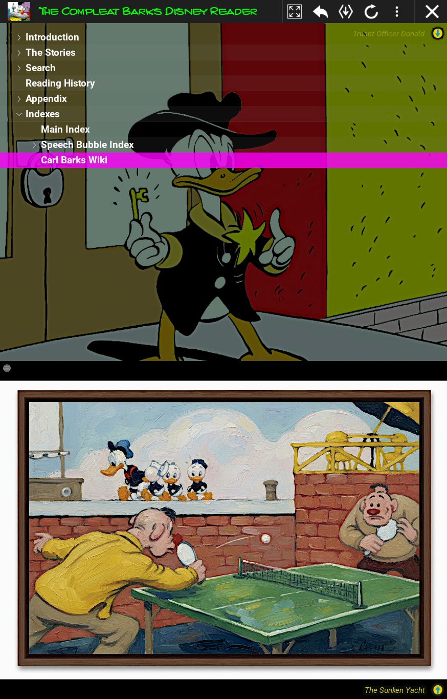
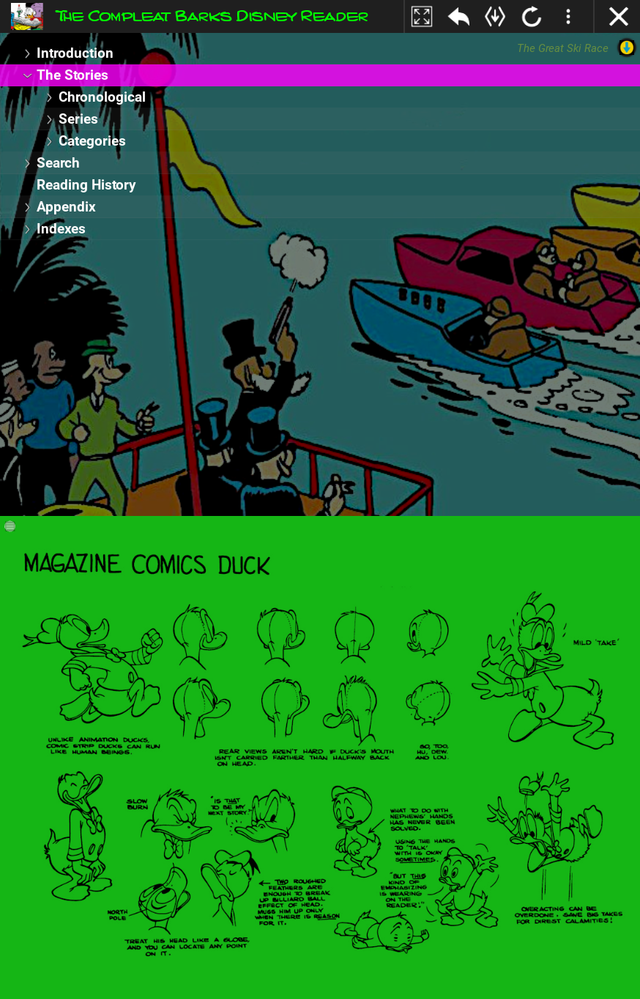
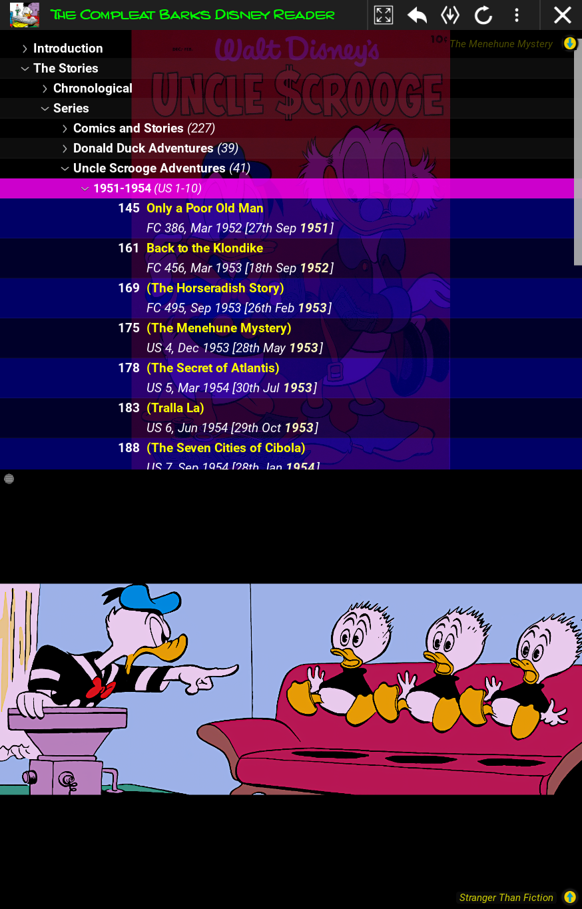
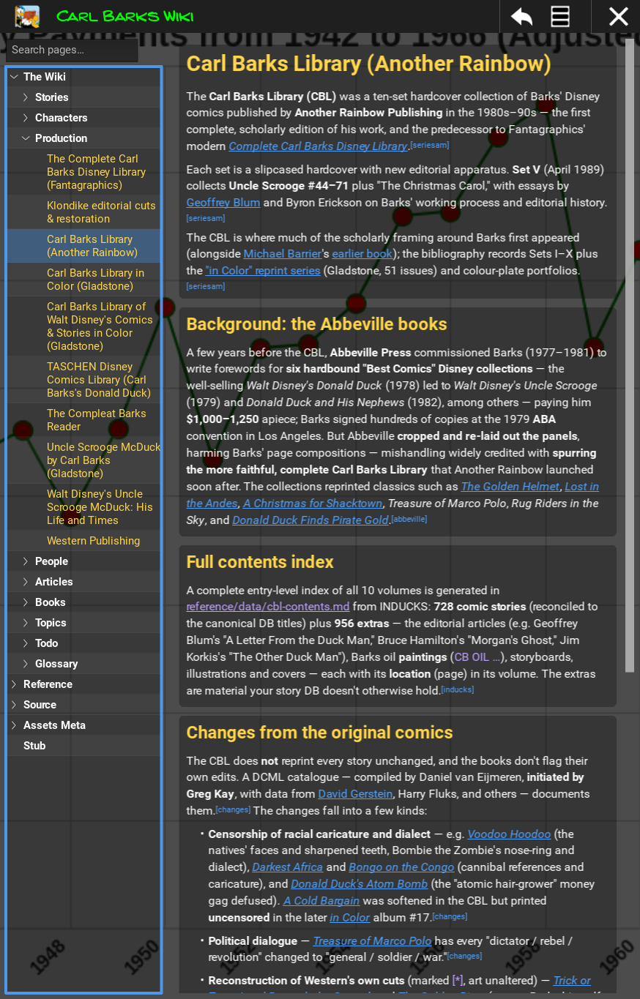
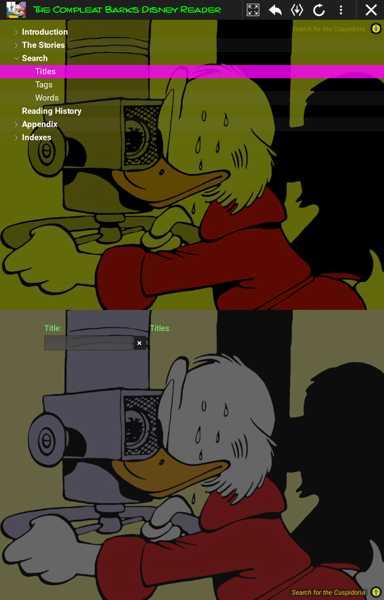
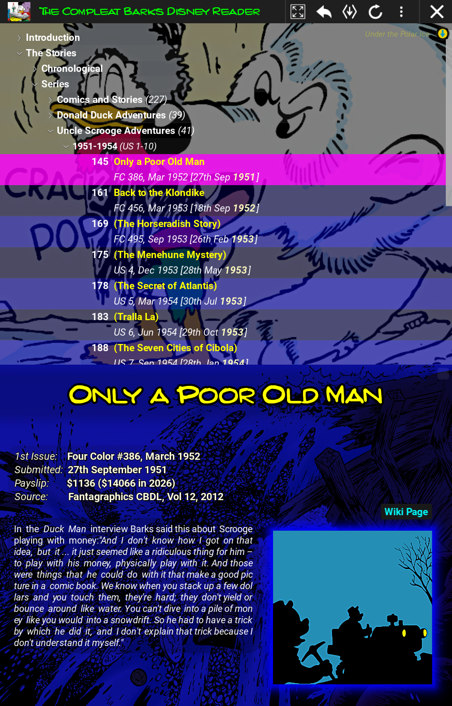

# Design review — July 2026

A UI/visual-design critique of the Barks Reader, produced from a live walkthrough of the
running app (main tree, series/title drill-down, title view, search, Carl Barks Wiki, and the
fullscreen comic reader), cross-checked against the styling code. The app's keyboard UX
constraint applies throughout: everything must work with only Esc/Enter/Left/Right/Up/Down
(4K TV + 6-button remote).

## Verdict in one line

The app sits on a world-class visual identity — Barks' own art on every screen, his lettering
font for display type, silhouette panels, a chrome-free reader — and then undercuts it with
arbitrary full-screen color washes and programmer-palette accents that don't come from Barks'
world.

## What genuinely works

- **The comic reader is the best screen in the app.** Pure black, zero chrome, art centered,
  controls hidden until Escape. The comic is the hero and nothing competes with it.
- **The Carl Barks lettering font for display titles** ("Only a Poor Old Man" on the title
  view) is a real signature. Yellow with a black outline is authentic four-color cover
  vocabulary.
- **Art-as-wallpaper is the right instinct.** Rotating panels behind the tree, the framed
  "fun image" paintings, the silhouette thumbnails, and the italic caption naming the source
  artwork are details collectors will love.
- **The wiki screen is the most disciplined layout**: dark neutral article panels, gold
  headings, sane line length, readable body text.
- The yellow focus ring on focused toolbar buttons is a good 10-foot-UX primitive.

## The three defects that matter most

### 1. The tint roulette

Each navigation step re-tints the background art with a random hue: the same Donald panel
appears olive, then pure green; the Series list gets a blood-red wash; Search screams
magenta-purple. Consequences: (a) Barks' famously controlled palette — the app's single
greatest asset — is shown false-color; (b) tree-text legibility is a dice roll, because white
text lands on whatever luminance the tint produced.

Mechanism: `core/reader_colors.py` `RandomColorTint.get_random_color()` builds a near-black
base and randomizes 1–2 RGB channels in (200, 255); a new color is rolled on *every*
navigation in `core/view_pipeline.py` (`_set_top_view_image_color` and friends) and applied
as a Kivy `Image.color` multiply.

**Fix:** untinted art under one fixed dark scrim (a neutral grey multiply darkens with no hue
shift), so text legibility is constant everywhere and the art shows true colors.

*The boot screen: olive/red wash over the tree background art.*

*A later visit to the same screen: the art has turned pure green, and the bottom model-sheet
is green too.*

### 2. The programmer palette

- Selection bar is pure RGB magenta — `TREE_VIEW_NODE_SELECTED_COLOR = (1, 0, 1, 0.8)`
  (`ui/tree_view_nodes.py:39`) — a debug color that appears nowhere in Barks' world and
  clashes with the yellow title text.
- App title is pure lime green `(0, 1, 0, 1)` (`ACTION_BAR_TITLE_COLOR`,
  `core/reader_consts_and_types.py:9`), echoed by six repeated green `(0.5, 1, 0.5, 1)`
  labels in `search_screen.kv` and cyan buttons/checkbox labels on the title view.
- Row striping is pure blue `[0,0,0.4,0.4]` / `[0,0,1,0.4]` (`tree_view_nodes.py:155-156`).
- Two selection languages coexist: tree magenta vs the wiki sidebar's blue.

The masthead vocabulary of the actual comics — *Uncle Scrooge* red, cover-yellow, newsprint
cream — is visible in the very cover art the app displays behind these widgets.

**Fix:** a small central palette module with colors extracted from the cover art, applied to
selection, app title, search labels, striping, and focus ring.

*Magenta selection bar, blue striping — and the submitted year gets the strongest emphasis on
the row (bold + bright) while the story title itself doesn't.*

### 3. Escape is one Enter away from quitting the app

On the main screen, Escape enters action-bar "menu mode" with focus defaulting to button
index 0 — which is the quit X (`ui/main_screen.py:126-137`,
`ui/reader_keyboard_nav.py:155-163`). Enter then fires `app.close_app()` with **no
confirmation** (`main_screen.kv:131` → `barks_reader_app.py:137-142`). On a remote, backing
out of a screen and pressing Enter is a natural gesture; here it kills the app.

**Fix:** default menu-mode focus to a harmless button (go-back), and fence the quit button
with a confirmation popup (Enter = quit, Escape = stay), gated behind a settings toggle.
The comic reader's identical pattern is fine as-is — its X only closes the reader.

## Second-tier issues

- **Wiki background bleed** — giant chart text ("Payments from 1942 to 1966…") bleeds
  through behind the toolbar and between article panels.

  

- **Title-row emphasis is muddled** — the submission year gets bold-bright markup
  (`core/reader_formatter.py:164-166`), the strongest treatment on the row, while it's the
  least important fact. Bold belongs on the title.
- **The Titles search screen reads as unfinished** — a ~200 px input floating in space, a
  bare "Title:" label, a stray green "Titles" label, no `hint_text`, no visible results area,
  and the same artwork rendered twice (tinted above the split, untinted below).

  

- **Letterboxing inconsistency** — fun images randomly choose cover vs contain fit
  (`core/image_selector.py:362-364`), so sometimes edge-to-edge, sometimes floating in black
  bars.
- **Generic chrome glyphs** — Material-style toolbar icons sit an inch from the Carl Barks
  lettering and feel off-brand.
- **Caption/info label contrast** — the artwork-source caption and some title-view info
  labels sit at low contrast over busy art.

  

## Remediation plan

- **Phase 0** — this document.
- **Phase 1** — (a) palette swatches extracted from cover art, user picks; (b) fixed scrim
  replaces `RandomColorTint`; (c) Escape/quit safety (default focus + gated confirm popup);
  (d) quick wins: title-row emphasis swap, caption contrast, dead-color cleanup; (e) central
  `core/reader_palette.py` module applied to the defect-2 inventory.
- **Phase 2+** — search screen rework, deterministic letterboxing, okf-reader theme
  parameterization (TopBarSpec pattern) + wiki bleed fix + unified focus/selection language,
  chrome icon set, remaining color sweep.
