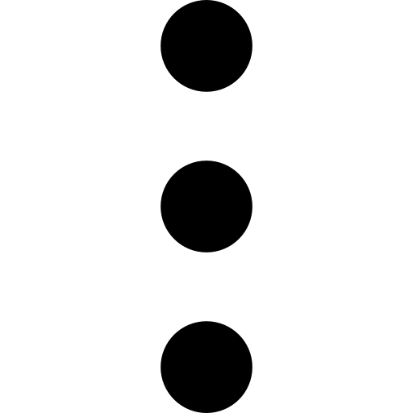

<h1  style="margin-top: 0; margin-bottom: 40px; line-height: 1;text-align: center;">How to Use the Barks Reader</h1>

The Barks Reader is designed to be easy to use and intuitive, but this guide is just in case.

---

## Concept

The Barks Reader gives you full access to all the Barks comics in your Fantagraphics
*"The Complete Carl Barks Disney Library"* digital collection. It knows exactly which
stories appear in which volumes and on which pages, and presents them through several
complementary navigation systems. And if you have a touchscreen 2-in-1 or hybrid 16-inch laptop,
then you can flip and fold it into a portrait screen and get a great Barks reading experience.

**No censorship.** Where Fantagraphics made alterations to Barks's original artwork — replacing
or modifying panels for editorial reasons — the Reader includes override image files that
restore the original artwork. These are applied automatically. However, some of the controversial fixes
(like 'Larkies' to 'Harpies') can be turned off individually in Settings if you prefer the
Fantagraphics versions.

---

## Main Screen Layout

### Top Menu Bar

The bar across the top of the main screen contains:

- **App icon** — on the far left, clickable; go to the story associated with icon image.
- 
  — closes the application.
- 
  — toggles between windowed and fullscreen mode.
- 
  — returns to the previously selected navigation node.
- 
  — collapses all expanded nodes in the navigation tree.
- 
  — randomly refreshes the background and panel images.
- 
  — opens a dropdown containing
    <strong><em>Settings,</em></strong> <strong><em>How To,</em></strong> and <strong><em>About.</em></strong>

### Navigation Tree (left panel)

The tree on the left is the primary way to find stories. Its top-level sections are:

- **Introduction** — introductory articles for the *Compleat Barks Reader* project.
- **The Stories** — all Barks stories, browsable in four ways:
  - *Chronological* — organised by Barks' submission dates.
  - *Series* — grouped by the comic series they appeared in (Comics & Stories, Donald Duck Adventures, 
    Uncle Scrooge Adventures, etc.).
  - *Categories* — thematic groupings.
- **Search** — find stories by title text or by tag.
- **Appendix** — supplementary articles and extra info.
- **Indexes** — two indexes: *alphabetic* and *speech bubbles*.

### Top Image Area

A large background image sits behind the navigation tree. It is decorative but also interactive:

- A **down-arrow button** at the top right navigates to the story associated with that image.
- Click **Refresh** in the menu bar to pick a new random image.

### Bottom Panel

The bottom half below the main tree content switches between two modes:

**Comic View** — shown when a story is selected in the tree. Displays the story's title,
publication info, and a favorite panel. Contains:

- A **title portal button** (bottom right) that opens the comic reader directly.
- A **last page read** indicator (optional) — the Reader remembers where you left off, and the portal
  button takes you back there.
- An **override toggle** (optional) — lets you turn off the censorship fix for this specific story.
- A **partially transparent collapse button** (top right of the bottom view) that hides the
  title info to show just the panel image. The portal button remains clickable even when
  collapsed.

**Fun View** — shown when no specific story is selected. Displays a random comic panel.

- A **category filter button** at the top left of the fun image lets you control which panel categories are shown.
- An **up-arrow button** at the bottom right of the fun image navigates to the story associated with
  the currently displayed panel.
- **Click left/right** of fun image or use **left/right keys** to step through the panel history.

---

## Reading the Comics

Open a comic by clicking its **title portal button** in the bottom comic view panel.

### Navigation

- **Click the left half** of the page, or use the **left arrow key** to go back one page.
- **Click the right half** of page, or use the **right arrow key** to go forward one page.

### Top Menu Bar (in the Reader)

The reader's menu bar is hidden by default in fullscreen mode. **Click near the top of the
screen** or use the **up arrow key** to make it appear. It contains:

- 
  — return to the main screen.
- 
  — toggles between windowed and fullscreen mode.
- 
  — toggle double page mode.
- 
  — jump to the first page.
- 
  — jump to the last page.
- 
  — opens a page selector showing all pages in the comic.

---

## Keyboard Navigation

You can navigate everything using a mouse, or if you have a touchscreen, using touch. But you can
also navigate almost everything using the keyboard (some small esoteric buttons are excluded).
Keyboard navigation is great if you're on a big screen TV and using a TV remote.
Keyboard navigation includes:
 
- **Left | Right arrow keys** — things like turning pages or moving focus to the left or right.
- **Up | Down arrow keys** — things like scrolling lists or moving focus up or down.
- **Esc key** — moving to a previous focus.

---

## Settings

Open *Settings* from the **⋯** menu on the top action bar. Key options are:

| Setting                                       | What it does                                                   |
|-----------------------------------------------|----------------------------------------------------------------|
| *Fantagraphics Directory*                     | Path to the folder containing your Fantagraphics ZIP files     |
| *Double Page Mode*                            | Opens every comic in two-page view                             |
| *Goto Last Selection on App Start*            | Resumes where you left off when the app starts                 |
| *Go Straight to Fullscreen on App start*      | Launches the app in fullscreen                                 |
| *Go Straight to Fullscreen for Comic Reading* | Auto-fullscreen when opening a comic                           |
| *Show Title Info in Top View*                 | Toggles story title display above the tree                     |
| *Show Title Info in Bottom View*              | Toggles story title display in the bottom panel                |
| *First Use of Reader*                         | Reset this to re-run the first-launch setup (requires restart) |
| *Log Level*                                   | Controls how much is written to the log file                   |
| *Controversial Censorship Fixes*              | Individual toggles for some censorship fixes                   |

Settings are saved to `"barks-reader.ini"` and `"barks-reader.json"` in the app's config directory.

---

## Logging

Log files are written to the `"logs"` subfolder of the app's config directory. The level of detail
is controlled by the **Log level** setting (TRACE / DEBUG / INFO / WARNING / ERROR / CRITICAL).
For normal use, INFO is appropriate. If you are reporting a problem, set it to DEBUG before
reproducing the issue, then include the log file with your report.
